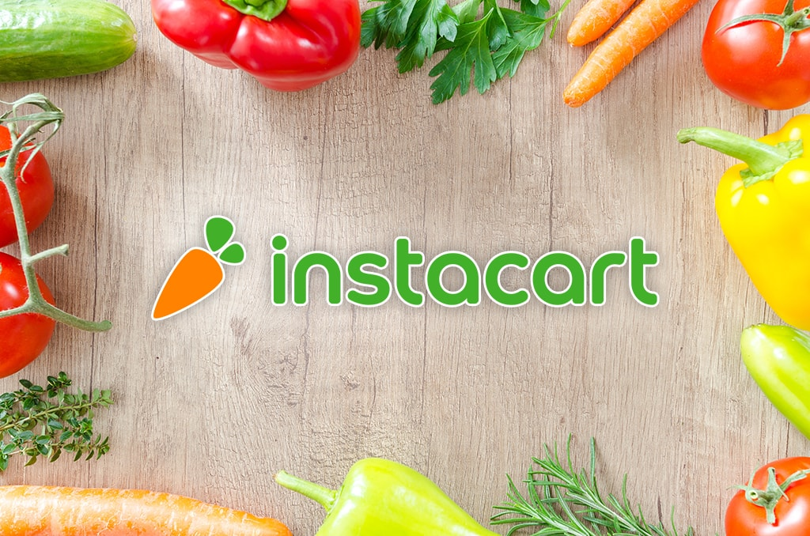

# Instacart Consumer Analysis

## Background

Instacart is an online grocery delivery service company that works with local stores to deliver groceries to your door.  When an order is placed, a local Instacart shopper goes to the store, picks up the items on your list, and then delivers it to you! 

My team is interested in attempting to discover if there any trends shared amongst the Instacart data.  We decided we would narrow our focus down to the fifty most commonly ordered vegetables and search for trends.

## Summary (with links to resources)

After downloading our [Instacart dataset](https://www.kaggle.com/c/instacart-market-basket-analysis/data), the first objective was create a list of all vegetables.  We used Pandas (Python) to clean the dataset and to scrape a list of vegetables from [vegetablesfruitsgrains.com](http://vegetablesfruitsgrains.com/list-of-vegetables/) using [beautifulsoup](https://pypi.org/project/beautifulsoup4/). The next step was to use a for loop to assign True/False conditions based on whether each product name matched our vegetable list. After filtering out non-vegetables from the dataframe, we with merged the Orders_Prior file to obtain order counts and loaded this to mySQL.  From there, we went on to determine 'organic' vegetables were strongly preferred over other vegetables.

More details can be found in our [Instacart Report](https://docs.google.com/document/d/1HpnmOSepOIK7yEkA4PbdTlUmIgmipytGtZhWGC4LPKs/edit?usp=sharing).

